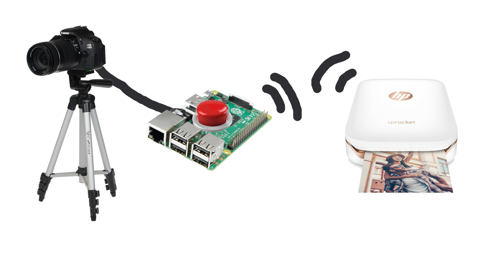
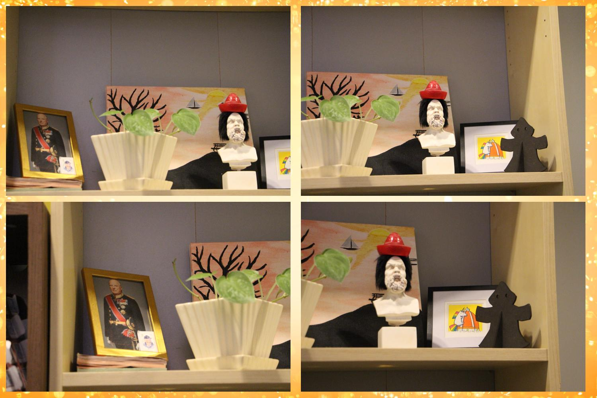
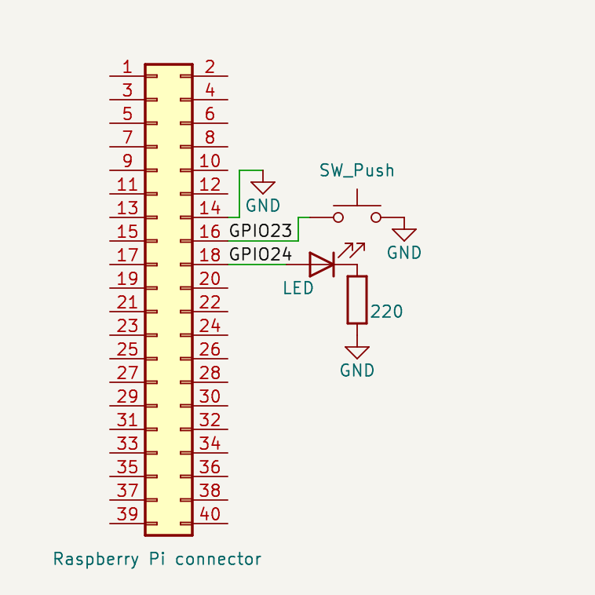

# Photobooth project

This is a photobooth project for my birthday celebration.
The concept of the project is a dslr camera connected to a respberry pi which captures four images with it and put them together in a single image. The image is then Sent to a small photo printer that prints the image.
**Here is an illustration of the concept**

**Here is an example of a possible resulting image**

### Technical details

I use a Canon dslr that I can connect to a Raspberry Pi via Python bindings for [gphoto2](http://gphoto.org/). The Python program running on the Raspberry Pi is [raspi_photobooth.py](./raspi_photobooth.py), which relies on [photobooth.py](./photobooth.py). The rasbperry pi connects to a [HP sprocket plus](https://www.hp.com/us-en/shop/pdp/hp-sprocket-plus-printer-p-2fr86a-b1h-1) mini printer over bluetooth. Images are transferred to the printer using [obexftp](http://dev.zuckschwerdt.org/openobex/wiki/ObexFtp), as described in [this blog](https://anotherpiblog.blogspot.com/2017/06/raspberry-pi-photobooth-with-bluetooth.html).

### Requirements

**Python**
- [pillow](https://pypi.org/project/pillow/)
- [gphoto2](https://pypi.org/project/gphoto2/)

**Software**
- [obexftp](http://dev.zuckschwerdt.org/openobex/wiki/ObexFtp)

**Hardware**
- A camera
(prefereably with flash and on wall power)
- A computer
(preferably a small Linux computer like a Raspberr Pi)
- A keyboard or button and that can tell the computer when to take an image
- A screen or led that indicates when images will be taken
- A printer that the computer can control

**Here is a schematic of the button and led connected to the raspberry pi**
